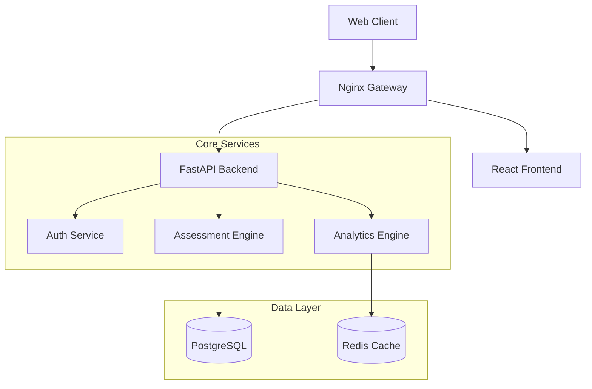

# EduMetrics: Intelligent Outcome-Based Education System

[](LICENSE)
[](https://python.org)
[](https://fastapi.tiangolo.com)
[](https://react.dev)
[](https://postgresql.org)
[](https://docker.com)

**EduMetrics** is an enterprise-grade Academic Management System designed for strictly regulated engineering institutions. It automates **Outcome-Based Education (OBE)** workflows, ensuring seamless compliance with **NBA** (National Board of Accreditation) and **NAAC** standards.

Unlike generic ERPs, EduMetrics focuses on **Question-Level Intelligence**—tracing every student mark back to a specific Course Outcome (CO) and Knowledge Level (Bloom's Taxonomy).

---

## 🚀 Why EduMetrics?

Traditional academic systems rely on averages and approximations. EduMetrics is different:

- **🔍 Question-Level Intelligence**: We don't just ask "How much did they score?". We ask "Which CO did they fail?" and "Was it a recall or application problem?".
- **📊 Automated Compliance**: Generate **NBA SAR** and **NAAC Criterion 2 & 3** reports in one click. No more Excel nightmares.
- **🛡️ Audit-Proof**: Every mark change, upgrading, or override is cryptographically logged.
- **⚡ Version-Aware**: A valid 2023 batch regulation remains valid in 2026, even if 2024 regulations change. Backlog students are always assessed against *their* original rules.

---

## 🌟 Key Features

### 🎓 For Students
- **Personalized Analytics**: View performance by Unit, Topic, and Bloom's level.
- **Weakness Detection**: "You are strong in *Theory* but weak in *Application*."
- **Transparency**: See internal vs. external performance gaps.

### 👨‍🏫 For Faculty
- **Exam Builder**: Create ISO-standard question papers mapped to COs.
- **Topic Coverage**: Visualise which topics are over-assessed or ignored.
- **Course Correction**: Identify if a specific CO is failing across the class.

### 👔 For HODs & Principals
- **Department Health**: Real-time CO/PO attainment dashboards.
- **Faculty Comparison**: Data-driven insight into teaching effectiveness.
- **Governance**: "Approve/Reject" workflows for marks and semester promotions.

---

## 🚀 Quick Start

Get the system running locally in under 5 minutes.

### Prerequisites
- Docker & Docker Compose
- Git

### Installation

1. **Clone the Repository**
   ```bash
   git clone https://github.com/outcome-master.git
   cd outcome-master
   ```

2. **Start Services**
   ```bash
   docker-compose up -d --build
   ```

3. **Access the Application**
   - **Frontend Dashboard**: `http://localhost:3000`
   - **API Documentation**: `http://localhost:8000/docs`

---

## 🏗️ System Architecture

EduMetrics follows a high-performance microservices-ready architecture:



---

## 📚 Documentation

We maintain comprehensive documentation for all stakeholders:

| Document | Audience | Description |
|----------|----------|-------------|
| [**Deployment Guide**](docs/DEPLOYMENT.md) | DevOps | Docker setup, environment configuration, and backups. |
| [**User Manual**](docs/USER_MANUAL.md) | Users | Step-by-step guides for Faculty, HODs, and Students. |
| [**API Reference**](docs/API.md) | Developers | REST API specifications and integration details. |

---

## 🛠️ Technology Stack

| Component | Technology | Reasoning |
|-----------|------------|-----------|
| **Backend** | Python 3.11 + FastAPI | Async performance with native type safety and easy data science integration. |
| **Frontend** | React 18 + TypeScript | Type-safe, component-driven UI with efficient state management. |
| **Database** | PostgreSQL 15 | Robust relational integrity for complex academic schemas. |
| **Caching** | Redis 7 | Sub-millisecond response times for heavy analytics aggregations. |
| **DevOps** | Docker | Consistent environments from development to production. |

---

## 🤝 Contributing

We welcome contributions! Please see our [Contributing Guide](CONTRIBUTING.md) for details on setting up your development environment and submitting Pull Requests.

---

## 📜 License

**Proprietary Software**.
Designed for Institutional Licensing. Unauthorized copying or distribution is strictly prohibited.

---

<div align="center">
  <sub>Built for precision. Engineered for compliance.</sub>
</div>
