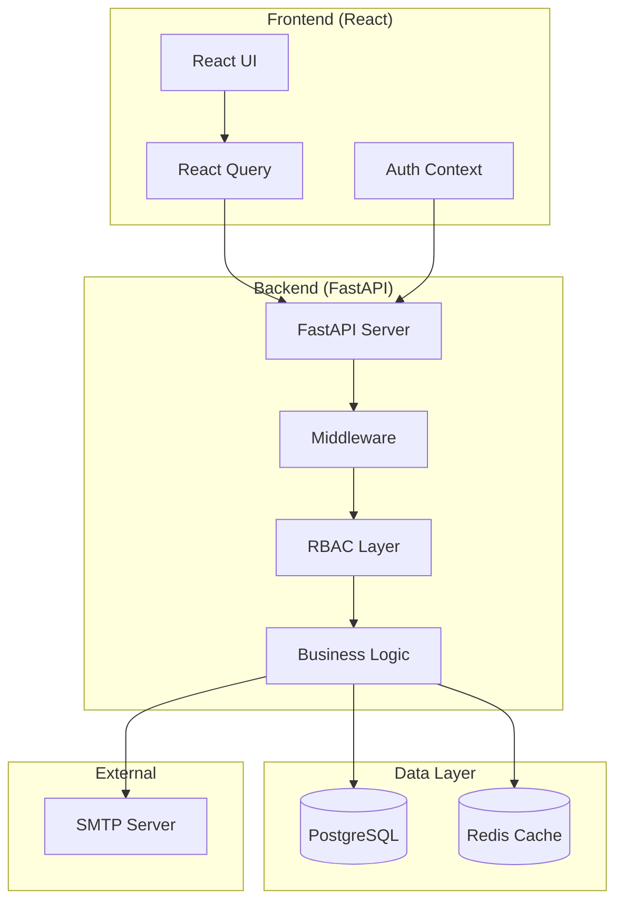
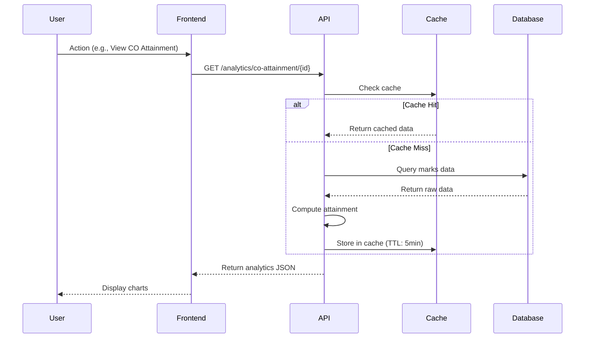
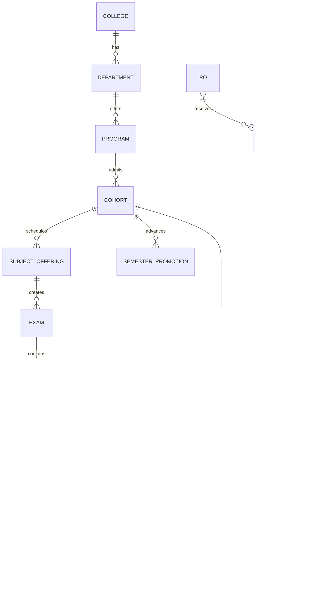
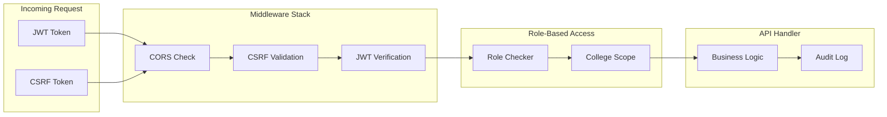
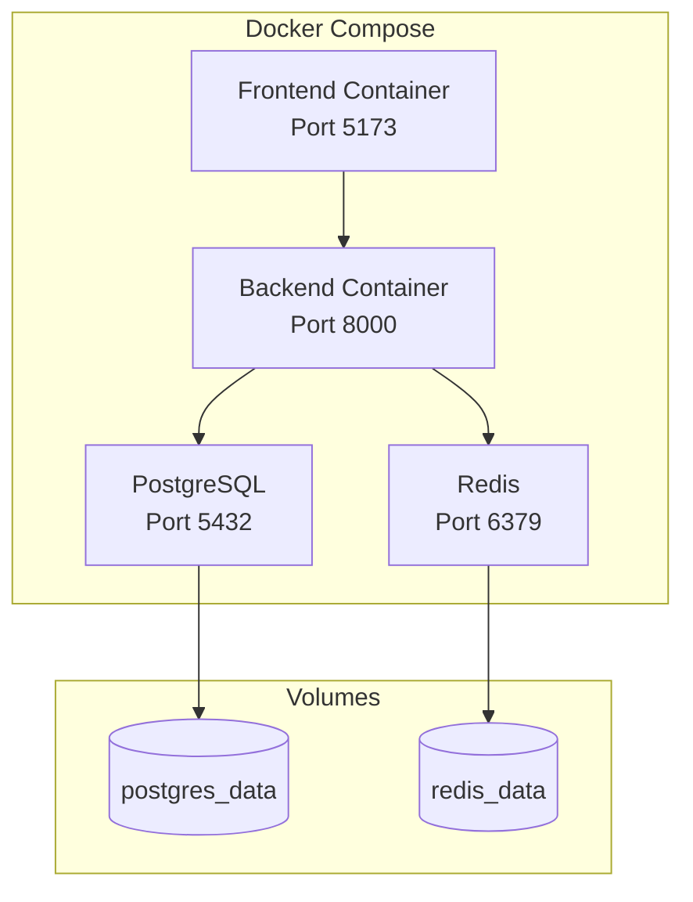

# EduMetrics Architecture

## System Overview

## Component Architecture

### Frontend Stack
| Component | Technology | Purpose |
|-----------|------------|---------|
| UI Framework | React 18 + TypeScript | Component-based UI |
| State Management | React Query | Server state caching |
| Routing | React Router v6 | Client-side navigation |
| Styling | TailwindCSS + shadcn/ui | Modern design system |
| Build Tool | Vite | Fast development builds |

### Backend Stack
| Component | Technology | Purpose |
|-----------|------------|---------|
| Framework | FastAPI | Async REST API |
| ORM | SQLAlchemy 2.0 | Database abstraction |
| Auth | JWT + bcrypt | Token-based auth |
| Migrations | Alembic | Schema versioning |
| Cache | Redis | Analytics caching |
| Scheduler | APScheduler | Background jobs |

## Data Flow

## Database Schema

## Security Architecture

## Deployment Architecture

## Role Hierarchy

| Role | Access Level | Key Permissions |
|------|--------------|-----------------|
| Student | Self-only | View own marks, analytics |
| Teacher | Assigned subjects | Enter marks, view subject analytics |
| HOD | Department-wide | Approve marks, manage dept, promotions |
| Principal | Institution-wide | Override actions, full analytics, user management |
